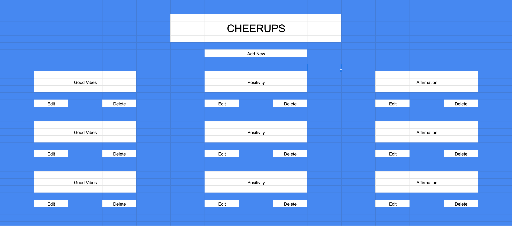
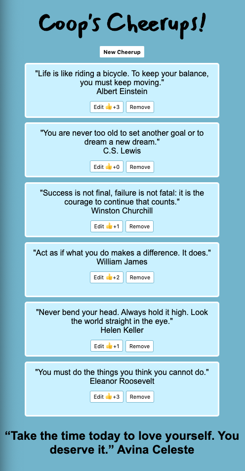
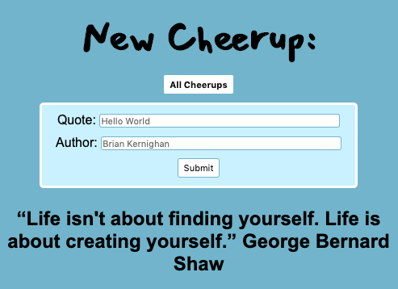
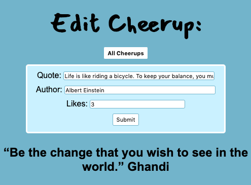

<h1>Coop's Cheerups</h1> 

## Description:
When you need a little positivity in your life, look no further than Cheerups. Coop's Cheerups allows you to read, post, edit, and delete from a board of positive quotes, while tracking positive and negative feedback through likes. 

## Examples:

## Current Features
On load, all Cheerups will be displayed in single rows, or rows of one to three, responsive to your browser. Underneath the logo, there is a "New Cheerup" button which directs users to a new page where they can create their own cheerup; on this page, they will be required to enter the quote and author, with a maximum of 100 and 20 characters for the quote and author, respectively. After submitting a new cheerup, they will be redirected back to the home page. Each cheerup has the option to edit or remove; the edit will direct the user to a new page that has pulled the new cheerup and allows users to edit the quote, author, and update likes. After submitting an edit, they will be redirected back to the home page. The remove button will instantly delete the quote.

## Features in Progress
The next feature I would like to add would be an account feature; this would allow users to sign in, attach their user to their quote, view all of their quotes from their page, as well as any additional quotes they 'liked'. This syncs with an update to the like feature, where I plan to utilize JS and event listeners to update the DB by clicking the 'thumbs up' or 'thumbs down', and linking 'liked' quotes to the users page. 

## Technologies Used
* HTML
* CSS
* JavaScript
* Express 
* Handlebars
* Mongoose
* Heroku

## Installation Instructions
Visit https://coopscheerups.herokuapp.com/ to Cheerup!

## Contribution Guidelines
View existing code here: https://github.com/coopertuch/GA-Project-2 
Submit an issue here: https://github.com/coopertuch/GA-Project-2/issues
